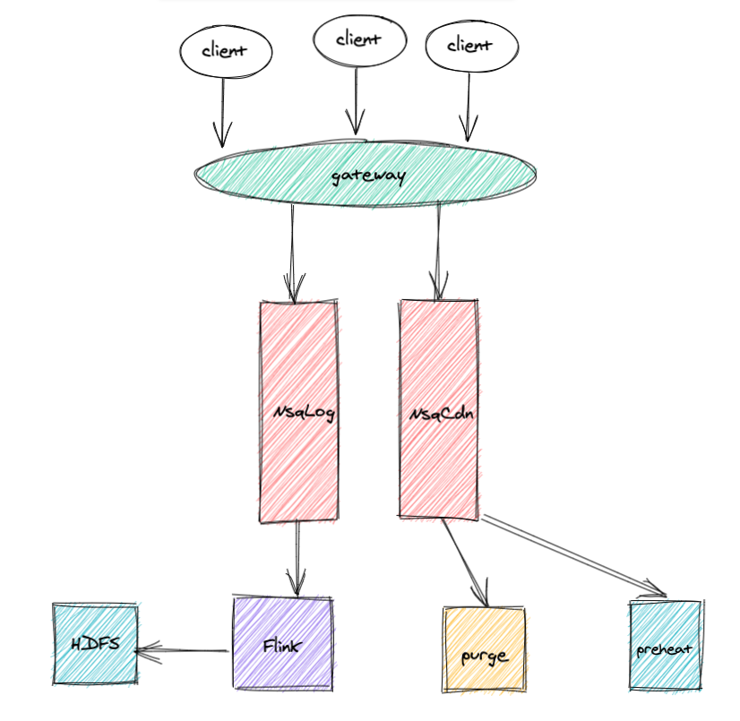

NSQ 是 bitly 公司开源的, 基于 Go 语言的分布式实时消息平台. NSQ 早已在又拍云的相关业务中落地, 并且每天处理上亿级别的消息时依旧能保持不错的性能.

### 与 NSQ 相关的架构

相关机器上的 client 会将消息统一上报到 gateway 网关层. gateway 会根据消息中元数据相关信息判断该消息归属的 NSQ 集群, 然后把消息提交到对应的Topic. 目前我们组有 2 个相互隔离的 NSQ 集群, 一个是 CDN 业务专享, 另一个集群现在日志服务用的比较多. 日志消息会被 NSQ 推送到 Flink 上进行 ETL 操作, 最终将流数据 sink 到 HDFS 上. CDN 专享的 NSQ 按照业务重要程度分了低,中,高 3 个 level 的 topic, 有若干个的实例订阅了这些 NSQ 的 Topic 进行消费.

### Flink

### 为什么要隔离 2 组 NSQ 集群?
众所周知, CDN 是用来做缓存资源加速的. CDN 的业务会因网络用户的使用习惯或其他客户的需求出现流量峰值, 比如晚上和节假日的流量要比其他时间段高很多. 在流量高峰期不只是 CDN 业务, 其他业务发送的消息也会比平时多很多倍. 所以部署 2 组 NSQ 集群, 主要是为了保障对实时消息敏感的业务在流量高峰期 NSQ 尽可能少的堆积消息.

此外, Flink 官方

## 参考文献
[1] [GoDoc of nsq](https://godoc.org/github.com/bitly/nsq)