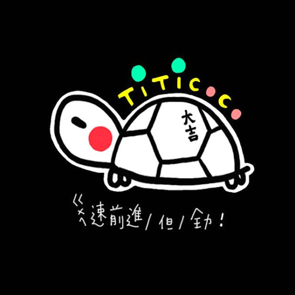

### 最近工作方向
现在做大数据和日志相关的工作.

### 业余时间

**在读**

+ [The C Programming Language](https://github.com/kougazhang/the_c_programming_language)
+ [C Primer Plus](https://github.com/kougazhang/c_primer_plus)
+ [道德经](https://github.com/kougazhang/daodejing)

**在考**

+ [非全日制硕士](https://github.com/kougazhang/graduate_exam)
+ [软件设计师](https://github.com/kougazhang/SoftEngineerExam/tree/master/%E8%BD%AF%E4%BB%B6%E8%AE%BE%E8%AE%A1%E5%B8%88)

### 已完成
+ [Effective Scala](https://twitter.github.io/effectivescala/index-cn.html)
+ [Scala School](https://github.com/kougazhang/scala_school)
+ [与孩子一起学编程](https://book.douban.com/subject/5338024/)
+ 代码大全

[🚀 返回主页]({{ '/' | absolute_url }})
